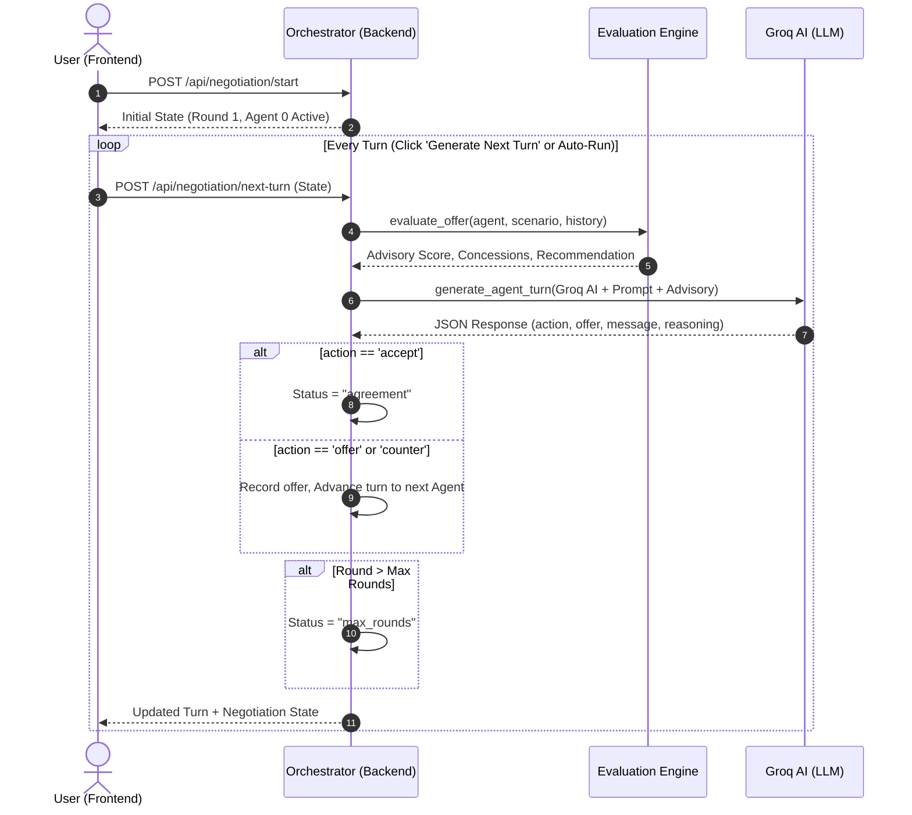

# Multi-Agent Construction Negotiation Simulator — Project Documentation & Architectural Guide

Welcome to the **Multi-Agent Construction Negotiation Simulator** documentation. This document provides a comprehensive breakdown of the application architecture, directory structure, detailed file explanations, agent reasoning logic, negotiation flow, prompts, round management, and inter-agent communication mechanisms.

---

## 1. Executive Summary & Purpose

In major construction projects, negotiations between general contractors, subcontractors, material suppliers, and project owners involve complex trade-offs across budget, scope, duration, quality, and risk tolerance. 

This application simulates **multi-agent commercial negotiations** powered by **Groq AI** (`groq/compound`, `qwen/qwen3.6-27b`, `openai/gpt-oss-120b`). Each agent represents a distinct stakeholder with custom financial constraints, strategic goals, and personality traits. The platform includes a hybrid intelligence architecture: an **LLM Reasoning Engine** for natural dialogue generation combined with an **Algorithmic Evaluation Engine** for real-time quantitative scoring, concession rate tracking, and risk advisory.

---

## 2. Comprehensive File-by-File Guide

Below is a complete breakdown of every file in the repository, explaining **why it exists**, **its purpose**, and **how it is used**.

### 📁 Root Directory (`/`)

#### 📄 [`PROJECT_DOCUMENTATION.md`](PROJECT_DOCUMENTATION.md)
* **Purpose**: This complete documentation guide explaining architecture, file purposes, agent reasoning, negotiation flow, and prompts.

#### 📄 [`DEPLOYMENT.md`](DEPLOYMENT.md)
* **Why it is present**: Provides step-by-step instructions for deploying the backend to cloud platforms (Render, Railway) and the frontend to static hosts (Vercel, Netlify).
* **Purpose**: Ensures smooth CI/CD and cloud deployment with environment variable configuration instructions.

#### 📄 [`package.json`](package.json)
* **Why it is present**: Serves as the top-level npm workspace configuration.
* **Purpose**: Allows running convenient root commands like `npm run dev` (starts frontend dev server) and `npm run build` from the workspace root.

#### 📄 [`vercel.json`](vercel.json)
* **Why it is present**: Configuration file for Vercel deployment.
* **Purpose**: Defines SPA (Single Page Application) routing rules so page refreshes don't trigger 404 errors.

#### 📄 [`.gitignore`](.gitignore)
* **Why it is present**: Specifies files and directories that Git should ignore.
* **Purpose**: Prevents checking in secret `.env` files, `node_modules/`, `__pycache__/`, `.venv/`, and build artifacts (`dist/`).

---

### 📁 Backend Directory (`/backend`)

#### 📄 [`backend/main.py`](backend/main.py)
* **Why it is present**: Entry point for the FastAPI Python web backend.
* **Purpose**: Exposes REST API endpoints for the React frontend:
  * `GET /health`: Health check endpoint.
  * `POST /api/test`: Connection test endpoint forwarding prompts to Groq AI.
  * `POST /api/negotiation/start`: Initializes a new negotiation state.
  * `POST /api/negotiation/next-turn`: Generates the next AI-reasoned turn for the active agent and advances negotiation state.
  * `POST /api/negotiation/evaluate`: Performs on-demand quantitative scoring and concession evaluation without advancing state.

#### 📄 [`backend/agent_reasoning.py`](backend/agent_reasoning.py)
* **Why it is present**: The core AI brain for negotiation agents.
* **Purpose**:
  1. Initializes the **Groq AI SDK** with `GROQ_API_KEY`.
  2. Defines **`PERSONALITY_PROMPTS`** (Aggressive, Collaborative, Risk-Averse).
  3. Constructs context-rich prompts (**`_build_prompt()`**) combining scenario context, goals, hard constraints, negotiation history, and advisory scoring engine feedback.
  4. Invokes Groq models using structured JSON mode (`response_format={"type": "json_object"}`).
  5. Implements **`_smart_algorithmic_turn()`** as a fail-safe fallback generator to guarantee realistic turns even if offline or if network API limits are reached.

#### 📄 [`backend/orchestrator.py`](backend/orchestrator.py)
* **Why it is present**: Manages state transitions, round tracking, and history in a stateless REST API model.
* **Purpose**:
  * Tracks current round (`1` to `max_rounds`), current active agent index, active/agreement/max_rounds status, and full message history.
  * Ensures agents take strict turns in round-robin sequence.
  * Enforces maximum round budget limits (status becomes `"max_rounds"` when the round budget is exhausted without consensus).

#### 📄 [`backend/counteroffer_evaluator.py`](backend/counteroffer_evaluator.py)
* **Why it is present**: Algorithmic decision and quantitative scoring engine.
* **Purpose**:
  * Parses numeric bounds from text constraints (e.g., "Minimum price $50,000" ➔ limit 50,000, lower bound).
  * Calculates an **Offer Score** (0–100) assessing constraint satisfaction and distance from ideal goals.
  * Computes **Concession Rates**, concession velocity, and remaining room for each agent across rounds.
  * Generates actionable recommendations (`ACCEPT`, `COUNTER`, `REJECT`) with suggested counter-offer numeric ranges.

#### 📄 [`backend/prompt_templates.py`](backend/prompt_templates.py)
* **Why it is present**: Single unified prompt template module consolidating all AI agent prompt generation logic.
* **Purpose**:
  * Contains `MASTER_PROMPT_TEMPLATE` embedding scenario context, hard constraints, negotiation history, personality instructions, and JSON schemas.
  * Encapsulates `AGENT_DOMAIN_GUIDELINES` for all 5 roles (Contractor, Supplier, Finance Manager, Project Manager, Client, plus custom fallback).
  * Implements `format_history()`, `format_evaluation_advisory()`, and `build_prompt_from_template()` (`get_agent_prompt`) for dynamically passing context-rich prompts to Groq AI models.

#### 📄 [`backend/test_counteroffer_evaluator.py`](backend/test_counteroffer_evaluator.py)
* **Why it is present**: Automated test suite containing 21 Pytest unit tests for the counteroffer evaluation engine.
* **Purpose**: Verifies constraint parsing, numeric scoring, concession tracking, and recommendation logic to prevent code regressions.

#### 📄 [`backend/test_agent_prompts.py`](backend/test_agent_prompts.py)
* **Why it is present**: Automated test suite for the prompt templates module.
* **Purpose**: Verifies prompt generation, dynamic role selection, history formatting, and agreement convergence simulations across all agent roles.

#### 📄 [`backend/requirements.txt`](backend/requirements.txt)
* **Why it is present**: List of required Python packages.
* **Purpose**: Installs `fastapi`, `uvicorn`, `gunicorn`, `groq`, `python-dotenv`, `pydantic`, and `requests`.

#### 📄 [`backend/.env`](backend/.env)
* **Why it is present**: Local configuration file containing sensitive secrets.
* **Purpose**: Stores `GROQ_API_KEY=gsk_...` for API authentication.

#### 📄 [`backend/.env.example`](backend/.env.example)
* **Why it is present**: Environment variable reference template.
* **Purpose**: Shared with developers as a template for `.env`.

#### 📄 [`backend/README.md`](backend/README.md)
* **Why it is present**: Quick setup and API documentation for backend developer onboarding.

#### 📄 [`backend/render.yaml`](backend/render.yaml) & [`backend/Procfile`](backend/Procfile)
* **Why they are present**: Cloud deployment manifests for Render and Heroku/Railway platforms.

---

### 📁 Frontend Directory (`/construction-negotiation-frontend`)

#### 📄 [`src/App.tsx`](construction-negotiation-frontend/src/App.tsx)
* **Why it is present**: The central React UI view and controller.
* **Purpose**:
  * Renders the 7 pre-configured construction scenarios (Material Shortage, Budget Overrun, Labor Shortage, Deadline Reduction, Scope Changes, Weather Delays, Equipment Breakdown), each with 3 agents — the scenario/agent data itself is defined in `src/data.ts`, not hardcoded in this file.
  * Provides personality pickers for each participating agent.
  * Features live negotiation control buttons (**Run Negotiation**, **Generate Next Turn**, **Auto-Run**).
  * Renders the interactive chat timeline, active agent badges, deal status badges (Live, Agreement Reached, Max Rounds Reached), and quantitative offer evaluation advisory panel.

#### 📄 [`src/App.css`](construction-negotiation-frontend/src/App.css) & [`src/index.css`](construction-negotiation-frontend/src/index.css)
* **Why they are present**: Modern CSS styling files.
* **Purpose**: Implements sleek glassmorphism UI design, curated dark mode color tokens, micro-animations, responsive layout flexbox/grid containers, and status indicator styles.

#### 📄 [`src/main.tsx`](construction-negotiation-frontend/src/main.tsx)
* **Why it is present**: React application entry point.
* **Purpose**: Mounts the top-level `<App />` component into the DOM `div#root`.

---

## 3. How Agents Work & Personality Profiles

Each agent in the simulation represents a commercial participant with four attributes:
1. **Name & Role**: e.g. *"Supplier Agent (Material Provider)"* or *"Contractor Agent (Material Buyer)"*.
2. **Goal**: Primary financial or operational target (e.g. *"Maximize profit margin on steel supply while retaining the client relationship."*).
3. **Hard Constraints**: Strict limits that the agent must **never** violate (e.g. *"Minimum price: ₹52,000 per ton"* or *"Budget cap for steel: ₹3.5 Cr"*).
4. **Personality**: Behavioral policy governing concession speed:
   * **Aggressive**: Pushes for maximum gain, concedes slowly, holds firm near ideal position.
   * **Collaborative**: Seeks win-win agreements, ready to make meaningful early concessions to reach consensus.
   * **Risk-Averse**: Prioritizes contract certainty and safe, defensible outcomes over aggressive margins.

---

## 4. Where the Agent Prompts are Located

All agent prompts are centrally defined in **[`backend/agent_reasoning.py`](backend/agent_reasoning.py)**.

### 1. System Prompt (Line 332)
```python
"You are an expert negotiation AI agent participating in a simulated construction negotiation. "
"You MUST respond ONLY with a valid JSON object."
```

### 2. Personality Prompts (Lines 25–41)
```python
PERSONALITY_PROMPTS = {
    "Aggressive": (
        "You push hard for maximum gain on every point. You concede slowly "
        "and only when the alternative is clearly worse than holding firm. "
        "Your offers stay close to your ideal outcome for as long as possible."
    ),
    "Collaborative": (
        "You look for win-win outcomes and value reaching consensus. You are "
        "willing to make meaningful concessions early if it moves the group "
        "toward agreement, as long as your hard constraints are respected."
    ),
    "Risk-Averse": (
        "You prioritize safe, predictable outcomes over chasing the best "
        "possible deal. You avoid offers that could fall through and prefer "
        "modest, defensible terms that are unlikely to be rejected."
    ),
}
```

### 3. Comprehensive Context Prompt (`_build_prompt()`, Lines 61–151)
The prompt dynamically injects:
* Role & Goal description
* Hard constraint list
* Personality behavioral instructions
* Full formatted history of previous rounds
* Outstanding offer currently on the table
* Quantitative Analysis Advisory block from the Evaluation Engine
* Expected JSON schema requirement:
```json
{
  "action": "offer" | "counter" | "accept" | "reject",
  "offer": <numeric value or null>,
  "message": "<in-character dialogue message>",
  "reasoning": "<private strategy explanation>"
}
```

---

## 5. What are Rounds and How Negotiation Flows

### What is a Round?
* A **Round** represents one full cycle of negotiations where active agents take their turns.
* The negotiation is capped by `max_rounds` (default: 10 rounds).
* **Round Pressure**: As the negotiation approaches `max_rounds`, agents receive pressure warnings in their prompt (*"This is the final round — weigh the cost of no deal carefully"*), incentivizing them to make final concessions or close the agreement.

### Step-by-Step Negotiation Flow



---

## 6. How Agents Communicate & Make Decisions

1. **Stateless Request-Response Loop**:
   The frontend maintains negotiation state. When advancing a turn, it posts state to `/api/negotiation/next-turn`.

2. **Communication Actions**:
   Agents communicate using 4 discrete actions:
   * **`offer`**: Propose an opening figure when no offer exists yet.
   * **`counter`**: Propose a revised numeric figure in response to an existing offer.
   * **`accept`**: Agree to the outstanding offer as-is, terminating negotiation with consensus (`"agreement"`).
   * **`reject`**: Terminate or reject terms that violate hard constraints.

3. **Hybrid Decision-Making Engine**:
   Before an agent acts, the **`counteroffer_evaluator.py`** calculates:
   * **Constraint Analysis**: Checks if the current offer violates hard limits.
   * **Concession Rate**: Measures how much the opponent has conceded compared to opening positions.
   * **Score (0–100)**: Evaluates overall offer quality.
   * This evaluation is passed as an **Advisory Guidance block** inside the prompt to guide Groq AI's decision.

4. **Algorithmic Fallback**:
   If network API connectivity to Groq is interrupted, **`_smart_algorithmic_turn()`** automatically computes realistic mathematical concessions based on personality and constraint bounds, ensuring the simulation never crashes.

---

## 7. How to Run & Test the Application

### Start Backend Server
```bash
cd backend
python main.py
```
* Backend runs at: `http://localhost:4000`

### Start Frontend Application
```bash
cd construction-negotiation-frontend
npm run dev
```
* Frontend runs at: `http://localhost:5173`

### Run Backend Automated Tests
```bash
pytest backend/test_counteroffer_evaluator.py
```
